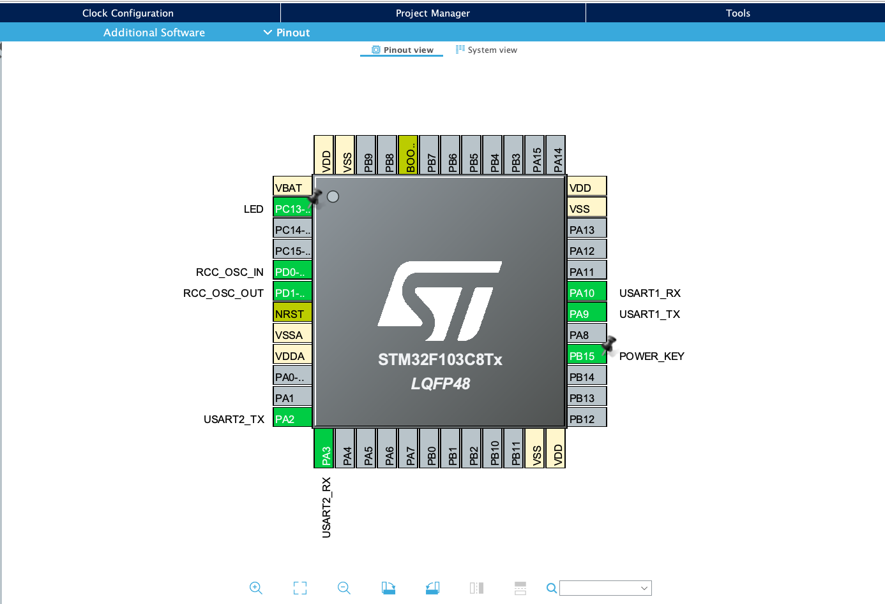
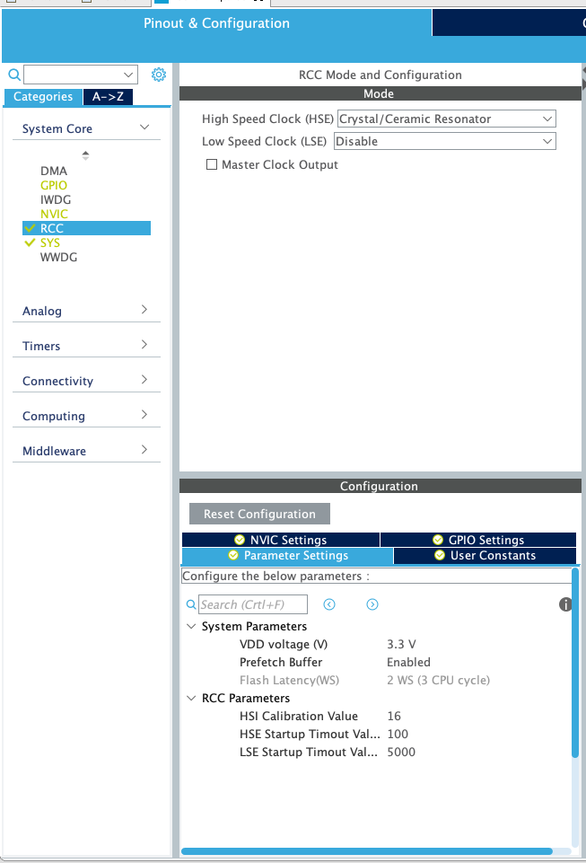
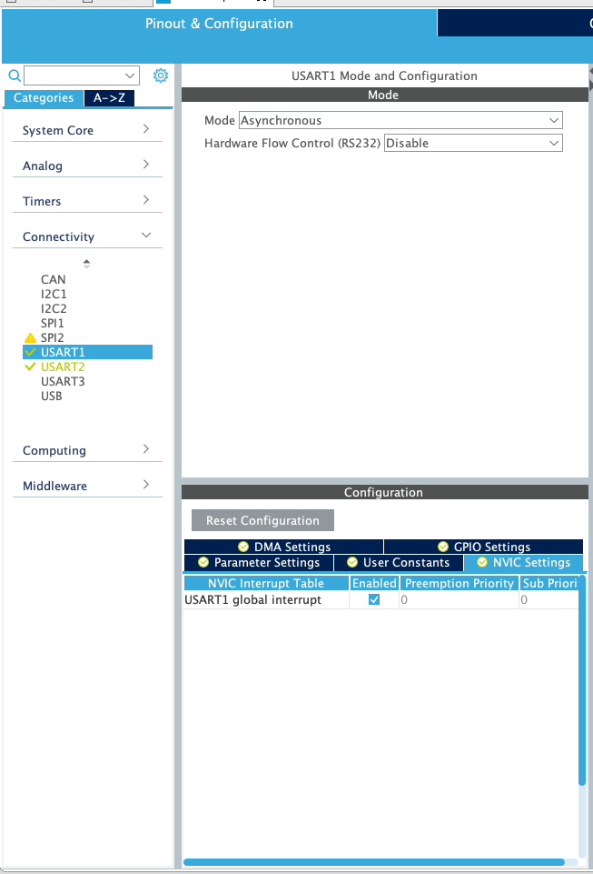
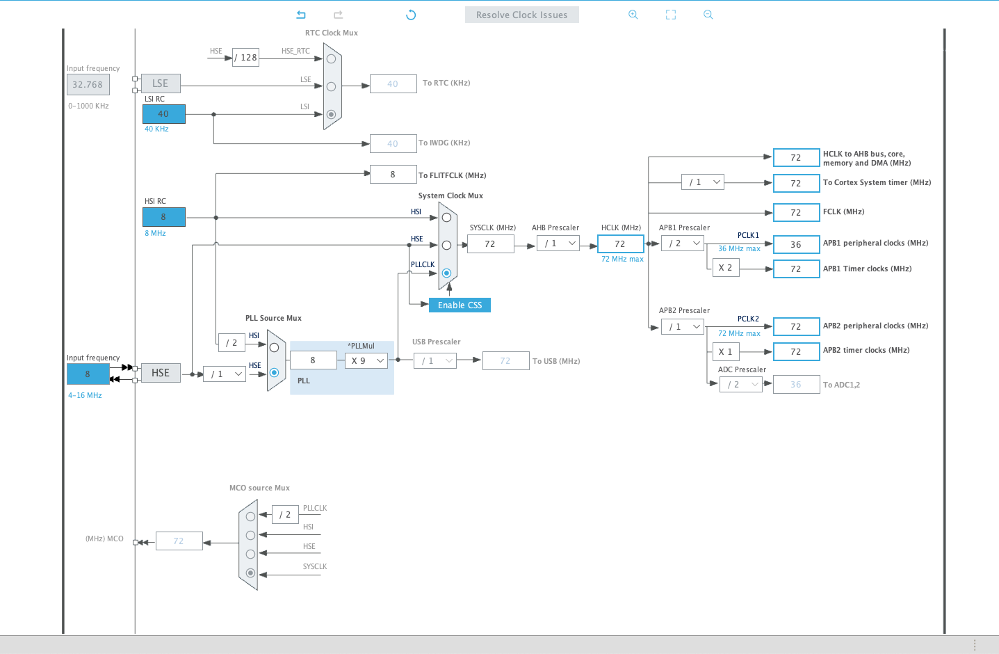
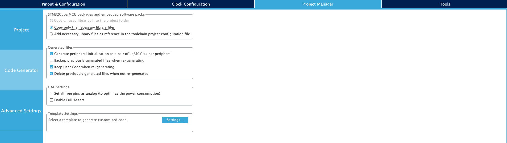
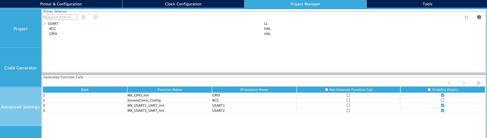

# Africa's Talking v1 R2 Dev Kit MQTT Sample for STM32CubeIDE

- See overrall config as shown below 
 


- Set `HSE` to `Crystal/Ceramic Resonator` and **disable** `LSE` as shown
 

- Set serial mode to `Asynchronous` for both  `USART1` and `USART2` and **ensure `gloabl interrupt` is enabled under `NVIC Settings`** 
 

## Clock Configuration 
- See below clock configuration.
    - Toggle `PLL` and `PLLCLK`
    - Set input frequency to `8Mhz`

- You might want to set the multiplier `PLLMul` to **11 or above** then click `Resolve Clock Issues` 


## Project Management 
- Under Project Manager ensure `Generate peripheral initialization...` is checked 
 

- Then inside `Advanced Settings` Set USART driver to `LL`  



**SAVE AND GENERATE PROJECT**

## Important 

- Inside [./Core/Inc/main.h](./Core/Inc/main.h) ensure you have chaged the MQTT-Specific settings with your Africa's Talking Device Group and Password 

```c 
#define MQTT_USERNAME "<CoolPerson>"

#define MQTT_DEVICE_GROUP "<cooldevicegroup>"

#define MQTT_PASSWORD "<strongpassword>" // Mandatory field

#define AUTH_CREDENTIALS MQTT_USERNAME ":" MQTT_DEVICE_GROUP // Mandatory field; resolves to username:devicegroup

#define MQTT_QOS 1 // Can be 0 or 1 or 2

#define DEVICE_ID "Eris" // Mandatory Field
```

- Note that you can add new subscription callbacks or modifiy the subscription callback to do something else. See [./Core/Src/main.c](./Core/Src/main.c) 

```c 
void downStreamCommandHandler(MessageData *messageData)
{
  serialPrint("Received a message %s : \r\n", messageData->message->payload);
  serialPrint("Topic is %s \r\n", messageData->topicName);
  memset((char *)messageData->message->payload, '\0', sizeof(uint8_t));
  memset((char *)messageData->topicName, '\0', sizeof(uint8_t));
  serialPrint("Sending message \r\n");

  char dataMessage[100];
  mqttMessage.dup = 0;
  mqttMessage.qos = MQTT_QOS;
  mqttMessage.id = 0;
  mqttMessage.retained = 0;
  mqttMessage.payload = dataMessage;
  sprintf(dataMessage, "test");
  mqttMessage.payloadlen = strlen((char *)mqttMessage.payload) + 1;
  if (MQTTPublish(&mqttClient, (char *)DEVICE_UPSTREAM_TOPIC, &mqttMessage) == 0)
  {
    serialPrint("Message published \r\n");
  }
  else
  {
    serialPrint("Unable to publish message \r\n");
    sent_failed_count++;
  }
}
```

- See the APN configuration inside `./Core/Src/main.c` 

- Note that the line shown below is commented under `./Core/Src/syscalls.c` 

```c 
extern int __io_putchar(int ch) __attribute__((weak)); 
``` 
- Also note that an IRQ handler is required for USART1; see `./Core/Src/stm32f1xx_it.c`.

- Note the **differences** under `./Core/{*}/usart.{*}` 

## Fun Excercises

- Prevent the device from republishing the `birth message` when connected.
- Repurpose the `downStreamCommandHandler(MessageData *messageData)` to blink the LED `PC13` (enabled) for a number of times (N) for (X) seconds when (N,X) is sent to it under the `<username>/<devicegroup>/Eris/rec` topic.
- Confirm that you can receive the `will message` when disconnected.

## Troubleshooting

- If the hardware fails to connect to the GSM nework within 30 seconds,
    1. Give it more time, the program will try to restart the GSM module
    2. Manually reset the board
    3. Your USB host might not be delivering sufficient power or you're using a longer cable